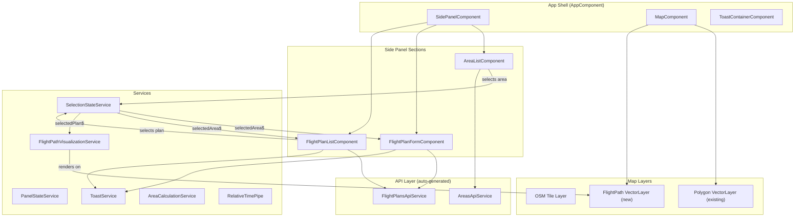
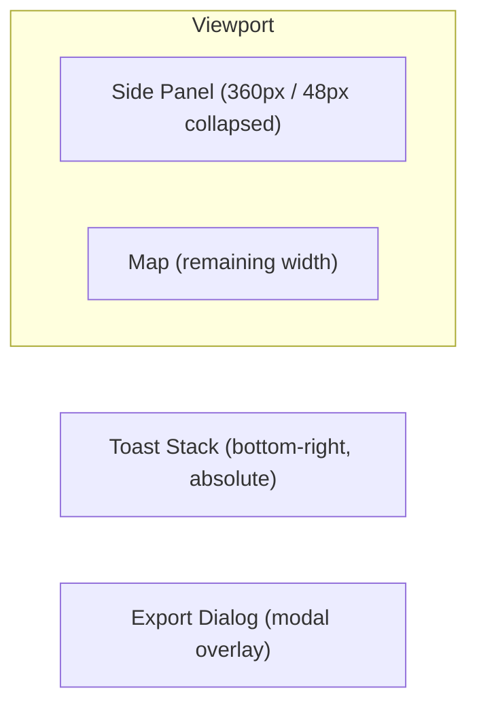
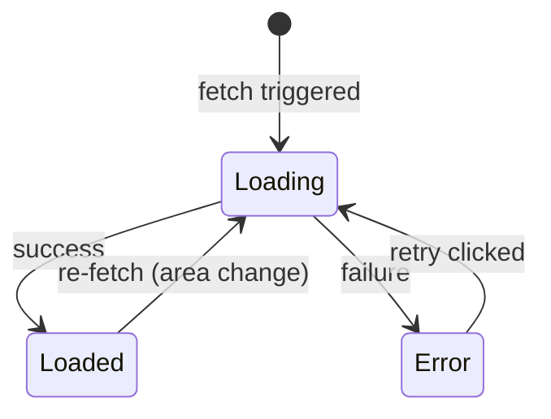

# Design Document: drone-mesh-gui

## Overview

This design defines the complete GUI layer for the DroneMesh3D Angular 21 application — a drone flight planning tool. The GUI introduces a professional dark-themed design system, a collapsible side panel housing area lists, flight plan configuration forms, and flight plan history. It adds flight path visualization on the OpenLayers map, an export dialog for mission files, toast notifications, skeleton loading states, tablet responsiveness, and full keyboard/ARIA accessibility.

The architecture leverages Angular 21 signals for reactive state management (zoneless change detection), standalone components with OnPush strategy, and OpenLayers 10.9 vector layers for map visualizations. All components consume design tokens via CSS custom properties declared in a single `_tokens.scss` file.

### Key Design Decisions

1. **Signal-based state over NgRx**: The application's state complexity (selected area, selected plan, panel state) doesn't warrant a full store. Angular signals with computed values provide sufficient reactivity with less boilerplate.
2. **Dedicated VectorLayer for flight paths**: Avoids conflicts with the existing polygon drawing layer by isolating flight path features in their own layer/source.
3. **CSS custom properties for theming**: Enables runtime theme switching potential and keeps component styles decoupled from specific color values.
4. **CDK-inspired patterns without CDK dependency**: Focus trap, virtual scrolling, and overlay behaviors are implemented using lightweight custom directives rather than pulling in `@angular/cdk` to keep bundle size minimal.
5. **Service-based toast**: A singleton `ToastService` with a signal-based queue decouples notification triggers from any specific component tree location.

## Architecture



### Layout Structure



## Components and Interfaces

### 1. Design System (`_tokens.scss`)

A single SCSS file declaring all CSS custom properties on `:root`. Imported by `styles.scss` (global). No component logic — purely declarative tokens.

### 2. AppComponent (modified)

```typescript
// Template adds SidePanelComponent and ToastContainerComponent alongside MapComponent
@Component({
  selector: 'app-root',
  imports: [MapComponent, SidePanelComponent, ToastContainerComponent],
  template: `
    <app-side-panel />
    <app-map [class.panel-expanded]="panelState.isExpanded()" />
    <app-toast-container />
  `
})
export class AppComponent {
  panelState = inject(PanelStateService);
}
```

### 3. SidePanelComponent

```typescript
interface SidePanelComponent {
  // Inputs: none (reads PanelStateService)
  // Outputs: none (writes PanelStateService)
  // Responsibilities:
  //   - Toggle expanded/collapsed state
  //   - Render Area_List, Flight_Plan_Form, Flight_Plan_List sections
  //   - Handle mobile overlay mode (< 768px)
  //   - Manage collapsible sections with aria-expanded
}
```

### 4. AreaListComponent

```typescript
interface AreaListComponent {
  // Reads: AreasApiService.listAreas()
  // Writes: SelectionStateService.selectArea(id)
  // State signals:
  //   areas: Signal<AreaResponse[]>
  //   loading: Signal<boolean>
  //   error: Signal<string | null>
  //   selectedAreaId: Signal<string | null>
  // Keyboard: arrow keys navigation, Enter/Space select
  // Virtual scroll: triggered when areas.length > 50
}
```

### 5. FlightPlanFormComponent

```typescript
interface FlightPlanFormComponent {
  // Reads: SelectionStateService.selectedAreaId()
  // Writes: FlightPlansApiService.calculate(), ToastService.show()
  // State signals:
  //   mode: Signal<'Grid' | 'Poi'>
  //   submitting: Signal<boolean>
  //   formValid: Signal<boolean>
  // Reactive Forms: FormGroup with dynamic controls based on mode
  // Validation: range validators on blur + value change
}
```

### 6. FlightPlanListComponent

```typescript
interface FlightPlanListComponent {
  // Reads: FlightPlansApiService.list({ areaId }), SelectionStateService.selectedAreaId()
  // Writes: SelectionStateService.selectPlan(id)
  // State signals:
  //   plans: Signal<FlightPlanResponse[]>
  //   loading: Signal<boolean>
  //   error: Signal<string | null>
  //   selectedPlanId: Signal<string | null>
  // Keyboard: arrow keys + Enter/Space
}
```

### 7. FlightPathVisualizationService

```typescript
interface FlightPathVisualizationService {
  // Reads: SelectionStateService.selectedPlan()
  // Methods:
  renderFlightPath(waypoints: WaypointDto[]): void;
  clearFlightPath(): void;
  fitToFlightPath(): void;
  // Manages a dedicated VectorSource + VectorLayer
  // Creates point features (waypoints) and a LineString feature (path)
}
```

### 8. ExportDialogComponent

```typescript
interface ExportDialogComponent {
  // Input: planId (string)
  // State signals:
  //   selectedFormat: Signal<ExportFormat>
  //   exporting: Signal<boolean>
  //   error: Signal<string | null>
  // Methods:
  //   download(): void — calls FlightPlansApiService.exportMissionFile()
  //   close(): void — emits closed event
  // Focus trap: Tab/Shift+Tab cycles within dialog
  // Keyboard: Escape closes
}
```

### 9. ToastService & ToastContainerComponent

```typescript
interface ToastService {
  show(type: 'success' | 'error' | 'info', message: string): void;
  dismiss(id: string): void;
  // Internal: signal-based queue, max 3 visible, max 10 pending
}

interface ToastNotification {
  id: string;
  type: 'success' | 'error' | 'info';
  message: string;
  createdAt: number;
}
```

### 10. SkeletonComponent

```typescript
@Component({
  selector: 'app-skeleton',
  standalone: true,
  // Renders animated placeholder rectangles
  // Respects prefers-reduced-motion
})
export class SkeletonComponent {
  readonly lines = input(3);        // number of skeleton lines
  readonly height = input('1rem');   // height of each line
}
```

### 11. EmptyStateComponent

```typescript
@Component({
  selector: 'app-empty-state',
  standalone: true,
})
export class EmptyStateComponent {
  readonly icon = input<'map' | 'route' | 'pointer'>('map');
  readonly heading = input.required<string>();
  readonly description = input.required<string>();
}
```

### Services

| Service | Responsibility |
|---------|---------------|
| `PanelStateService` | Manages side panel expanded/collapsed signal |
| `SelectionStateService` | Manages selectedAreaId and selectedPlanId signals, exposes computed selectedArea and selectedPlan |
| `FlightPathVisualizationService` | Creates/clears OpenLayers features for flight path on dedicated VectorLayer |
| `ToastService` | Queue-based notification service with signals |
| `AreaCalculationService` | Pure function: calculates polygon area in hectares from GeoJSON coordinates |
| `RelativeTimePipe` | Transforms ISO date string to locale-appropriate relative time |

## Data Models

### State Signals (SelectionStateService)

```typescript
// Central selection state — consumed by multiple components
interface SelectionState {
  selectedAreaId: WritableSignal<string | null>;
  selectedPlanId: WritableSignal<string | null>;
  selectedArea: Signal<AreaResponse | null>;       // computed from areas + selectedAreaId
  selectedPlan: Signal<FlightPlanResponse | null>; // computed from plans + selectedPlanId
}
```

### Toast Queue Model

```typescript
interface ToastNotification {
  id: string;                          // crypto.randomUUID()
  type: 'success' | 'error' | 'info';
  message: string;                     // max 150 chars displayed, full in title
  createdAt: number;                   // Date.now()
  autoDismiss: boolean;                // false for error type
}
```

### Flight Path Visualization Model

```typescript
// Derived from FlightPlanResponse.waypoints for OL rendering
interface FlightPathFeatureData {
  waypoints: Array<{
    coordinate: [number, number]; // EPSG:3857 projected
    index: number;                // 1-based
    altitude: number;
  }>;
  pathCoordinates: Array<[number, number]>; // EPSG:3857 projected line
}
```

### Form Models

```typescript
interface GridFormValue {
  altitudeM: number;
  sensorWidthMm: number;
  focalLengthMm: number;
  imageWidthPx: number;
  imageHeightPx: number;
  frontOverlapPercent: number;
  sideOverlapPercent: number;
  headingDegrees: number | null;
}

interface PoiFormValue {
  centerLatitude: number;
  centerLongitude: number;
  radiusM: number;
  altitudeM: number;
  gimbalPitchDegrees: number;
  photoCount: number | null;
  overlapPercent: number | null;
  cameraHorizontalFovDegrees: number | null;
  structureHeightM: number | null;
}
```

### Design Token Structure

```scss
:root {
  // Colors
  --ds-color-primary: hsl(210, 100%, 56%);
  --ds-color-primary-hover: hsl(210, 100%, 64%);
  --ds-color-secondary: hsl(260, 60%, 55%);
  --ds-color-surface: hsl(220, 20%, 12%);
  --ds-color-surface-elevated: hsl(220, 18%, 16%);
  --ds-color-background: hsl(220, 22%, 8%);
  --ds-color-text-primary: hsl(0, 0%, 95%);
  --ds-color-text-secondary: hsl(0, 0%, 72%);
  --ds-color-text-muted: hsl(0, 0%, 50%);
  --ds-color-border: hsl(220, 15%, 22%);
  --ds-color-success: hsl(145, 63%, 42%);
  --ds-color-warning: hsl(38, 92%, 55%);
  --ds-color-error: hsl(0, 72%, 51%);
  --ds-color-overlay: hsla(220, 22%, 8%, 0.5);

  // Spacing (4px scale)
  --ds-spacing-xs: 4px;
  --ds-spacing-sm: 8px;
  --ds-spacing-md: 16px;
  --ds-spacing-lg: 24px;
  --ds-spacing-xl: 32px;
  --ds-spacing-2xl: 40px;
  --ds-spacing-3xl: 48px;

  // Typography
  --ds-font-family: 'Inter', -apple-system, BlinkMacSystemFont, 'Segoe UI', sans-serif;
  --ds-font-size-xs: 0.75rem;
  --ds-font-size-sm: 0.875rem;
  --ds-font-size-md: 1rem;
  --ds-font-size-lg: 1.125rem;
  --ds-font-size-xl: 1.25rem;
  --ds-font-size-2xl: 1.5rem;
  --ds-font-weight-regular: 400;
  --ds-font-weight-medium: 500;
  --ds-font-weight-semibold: 600;
  --ds-font-weight-bold: 700;
  --ds-line-height-tight: 1.25;
  --ds-line-height-normal: 1.5;
  --ds-line-height-relaxed: 1.75;

  // Border radius
  --ds-radius-sm: 4px;
  --ds-radius-md: 8px;
  --ds-radius-lg: 12px;
  --ds-radius-xl: 16px;

  // Shadows
  --ds-shadow-sm: 0 1px 2px hsla(0, 0%, 0%, 0.3);
  --ds-shadow-md: 0 4px 8px hsla(0, 0%, 0%, 0.4);
  --ds-shadow-lg: 0 8px 24px hsla(0, 0%, 0%, 0.5);

  // Transitions
  --ds-transition-fast: 150ms;
  --ds-transition-normal: 250ms;
  --ds-transition-slow: 400ms;

  // Breakpoints (used via @media, stored as reference)
  --ds-breakpoint-tablet: 768px;
  --ds-breakpoint-desktop: 1024px;
}
```

## Correctness Properties

*A property is a characteristic or behavior that should hold true across all valid executions of a system — essentially, a formal statement about what the system should do. Properties serve as the bridge between human-readable specifications and machine-verifiable correctness guarantees.*

### Property 1: List items are sorted by creation date descending

*For any* non-empty array of items (AreaResponse or FlightPlanResponse) returned by the API, the displayed list order SHALL satisfy: for every consecutive pair of displayed items (item[i], item[i+1]), `item[i].createdAt >= item[i+1].createdAt`.

**Validates: Requirements 3.1, 5.1**

### Property 2: Polygon area calculation produces correct hectares

*For any* valid GeoJSON polygon (closed ring, ≥3 distinct vertices, coordinates within valid lat/lon ranges), the `AreaCalculationService.calculateHectares(coordinates)` function SHALL return a non-negative number equal to the spherical polygon area in square meters divided by 10000, rounded to 2 decimal places.

**Validates: Requirements 3.2**

### Property 3: Relative time formatting follows locale rules

*For any* ISO date string representing a date within the last 30 days relative to "now", the `RelativeTimePipe.transform(date)` SHALL return a string matching the pattern of relative time (e.g., containing a numeric value and a time unit). *For any* ISO date string representing a date older than 30 days, the result SHALL match the DD.MM.YYYY format (2 digits, dot separator, 4-digit year).

**Validates: Requirements 3.2**

### Property 4: Numeric range validation correctly classifies values

*For any* numeric value `v` and valid range `[min, max]` where `min < max`, the range validator SHALL return valid when `min <= v <= max`, and SHALL return invalid with an appropriate error message when `v < min` or `v > max`.

**Validates: Requirements 4.3, 4.4**

### Property 5: Keyboard list navigation cycles correctly

*For any* listbox with N > 0 items and current focus at index `i`, pressing ArrowDown SHALL move focus to index `(i + 1) % N`, and pressing ArrowUp SHALL move focus to index `(i - 1 + N) % N`. Pressing Enter or Space on the focused item SHALL select it (set aria-selected="true" on that item and emit the corresponding ID).

**Validates: Requirements 3.9, 5.8**

### Property 6: Flight time formatting is correct

*For any* non-negative integer `totalSeconds`, the formatted flight time string SHALL equal `"${Math.floor(totalSeconds / 60)} min ${totalSeconds % 60} s"`.

**Validates: Requirements 5.2**

### Property 7: Flight path visualization preserves waypoint count, order, and labels

*For any* array of N waypoints (N ≥ 1), the Flight_Path_Visualization SHALL create exactly N point features with labels numbered 1 through N (in the original array order), and exactly one LineString feature with N coordinate pairs matching the input waypoint coordinates (transformed to map projection) in the same sequence.

**Validates: Requirements 6.2, 6.3**

### Property 8: Focus trap cycles within modal boundaries

*For any* modal dialog containing K ≥ 1 focusable elements, pressing Tab when the last focusable element is focused SHALL move focus to the first focusable element, and pressing Shift+Tab when the first focusable element is focused SHALL move focus to the last focusable element.

**Validates: Requirements 7.10, 11.5**

### Property 9: Toast type determines auto-dismiss behavior and ARIA attributes

*For any* toast notification, IF the type is 'success' or 'info' THEN the toast SHALL have `role="status"`, `aria-live="polite"`, and SHALL auto-dismiss after 5000ms. IF the type is 'error' THEN the toast SHALL have `role="alert"`, `aria-live="assertive"`, and SHALL NOT auto-dismiss.

**Validates: Requirements 8.4, 8.6**

### Property 10: Toast queue maintains max 3 visible invariant

*For any* sequence of `show()` calls producing N total toasts where N > 3, the number of simultaneously visible toasts SHALL never exceed 3. When a visible toast is dismissed, the oldest item from the pending queue SHALL become visible (FIFO). The pending queue SHALL hold a maximum of 10 items; additional toasts beyond the queue capacity SHALL be discarded.

**Validates: Requirements 8.7**

### Property 11: Toast message truncation at 150 characters

*For any* message string of length L, IF L > 150 THEN the displayed text SHALL equal `message.substring(0, 150) + "…"` and the element's title attribute SHALL contain the full original message. IF L <= 150 THEN the displayed text SHALL equal the full message.

**Validates: Requirements 8.9**

## Error Handling

### API Error Strategy

| Error Source | Handling | User Feedback |
|---|---|---|
| AreasApiService.listAreas() fails | Catch in AreaListComponent, set error signal | Inline error message + retry button in Area_List section |
| FlightPlansApiService.list() fails | Catch in FlightPlanListComponent, set error signal | Inline error message + retry button in Flight_Plan_List section |
| FlightPlansApiService.calculate() fails | Catch in FlightPlanFormComponent | Toast notification (type: error) with API error message |
| FlightPlansApiService.exportMissionFile() 404/422 | Catch in ExportDialogComponent | Inline error below format options, re-enable Download |
| FlightPlansApiService.exportMissionFile() 500/network | Catch in ExportDialogComponent | Inline error: "Serwer niedostępny" or "Wystąpił nieoczekiwany błąd" |
| Export request timeout (30s) | AbortController + timeout operator | Inline error: "Przekroczono czas oczekiwania" |

### Error State Transitions



### Retry Strategy

- All retry operations re-invoke the original API call with the same parameters
- No exponential backoff for user-initiated retries (immediate re-call)
- Loading state shown during retry (skeleton or spinner, depending on context)
- Previous error message cleared on retry initiation

### Global Error Boundaries

- Unhandled HTTP errors (not caught by components) are logged to console
- No global error interceptor for toast — each component manages its own error display
- Network connectivity loss: individual component retries handle it; no global offline banner in scope

## Testing Strategy

### Dual Testing Approach

This feature uses both **unit tests** (example-based) and **property-based tests** (universal properties).

### Property-Based Testing (fast-check)

**Library**: `fast-check` (already in devDependencies)
**Runner**: Karma/Jasmine
**Minimum iterations**: 100 per property test

Each property test references its design property with a tag comment:
```typescript
// Feature: drone-mesh-gui, Property 1: List items are sorted by creation date descending
```

**Properties to implement:**

| Property | Target | Generator Strategy |
|---|---|---|
| 1. List sorting | `sortByCreatedAtDesc()` utility | `fc.array(fc.record({ createdAt: fc.date() }))` |
| 2. Area calculation | `AreaCalculationService.calculateHectares()` | `fc.array(fc.tuple(fc.double({min:-180,max:180}), fc.double({min:-90,max:90})), {minLength:3})` |
| 3. Relative time | `RelativeTimePipe.transform()` | `fc.date({ min: thirtyOneDaysAgo, max: now })` |
| 4. Range validation | `RangeValidator` | `fc.record({ value: fc.double(), min: fc.double(), max: fc.double() })` with constraint min < max |
| 5. Keyboard navigation | `ListKeyboardNavigationDirective` | `fc.record({ listLength: fc.integer({min:1,max:100}), currentIndex: fc.integer({min:0}), key: fc.constantFrom('ArrowDown','ArrowUp') })` |
| 6. Flight time format | `formatFlightTime()` utility | `fc.integer({ min: 0, max: 360000 })` |
| 7. Flight path viz | `FlightPathVisualizationService.renderFlightPath()` | `fc.array(fc.record({ latitude: fc.double({min:-90,max:90}), longitude: fc.double({min:-180,max:180}), ... }), {minLength:1})` |
| 8. Focus trap | `FocusTrapDirective` | `fc.record({ elementCount: fc.integer({min:1,max:20}), startIndex: fc.constantFrom('first','last'), key: fc.constantFrom('Tab','Shift+Tab') })` |
| 9. Toast type behavior | `ToastService` | `fc.constantFrom('success','error','info')` |
| 10. Toast queue | `ToastService` queue logic | `fc.array(fc.record({ action: fc.constantFrom('add','dismiss'), type: fc.constantFrom('success','error','info') }))` |
| 11. Toast truncation | `truncateMessage()` utility | `fc.string({ minLength: 0, maxLength: 500 })` |

### Unit Tests (Jasmine)

Unit tests cover:
- Component rendering states (loading, loaded, error, empty)
- User interactions (click, blur, submit)
- ARIA attributes and accessibility
- CSS class application based on state
- API service call verification with mocks
- Modal open/close behavior
- Responsive breakpoint behavior (via fixture viewport manipulation)

### Test Organization

```
Web/src/app/
├── components/
│   ├── side-panel/side-panel.component.spec.ts
│   ├── area-list/area-list.component.spec.ts
│   ├── flight-plan-form/flight-plan-form.component.spec.ts
│   ├── flight-plan-list/flight-plan-list.component.spec.ts
│   ├── export-dialog/export-dialog.component.spec.ts
│   ├── toast-container/toast-container.component.spec.ts
│   ├── skeleton/skeleton.component.spec.ts
│   └── empty-state/empty-state.component.spec.ts
├── services/
│   ├── panel-state.service.spec.ts
│   ├── selection-state.service.spec.ts
│   ├── flight-path-visualization.service.spec.ts
│   ├── toast.service.spec.ts
│   └── area-calculation.service.spec.ts
├── pipes/
│   └── relative-time.pipe.spec.ts
├── directives/
│   ├── focus-trap.directive.spec.ts
│   └── list-keyboard-nav.directive.spec.ts
└── utils/
    ├── sort-by-date.spec.ts          (property tests)
    ├── range-validator.spec.ts       (property tests)
    ├── format-flight-time.spec.ts    (property tests)
    └── truncate-message.spec.ts      (property tests)
```

