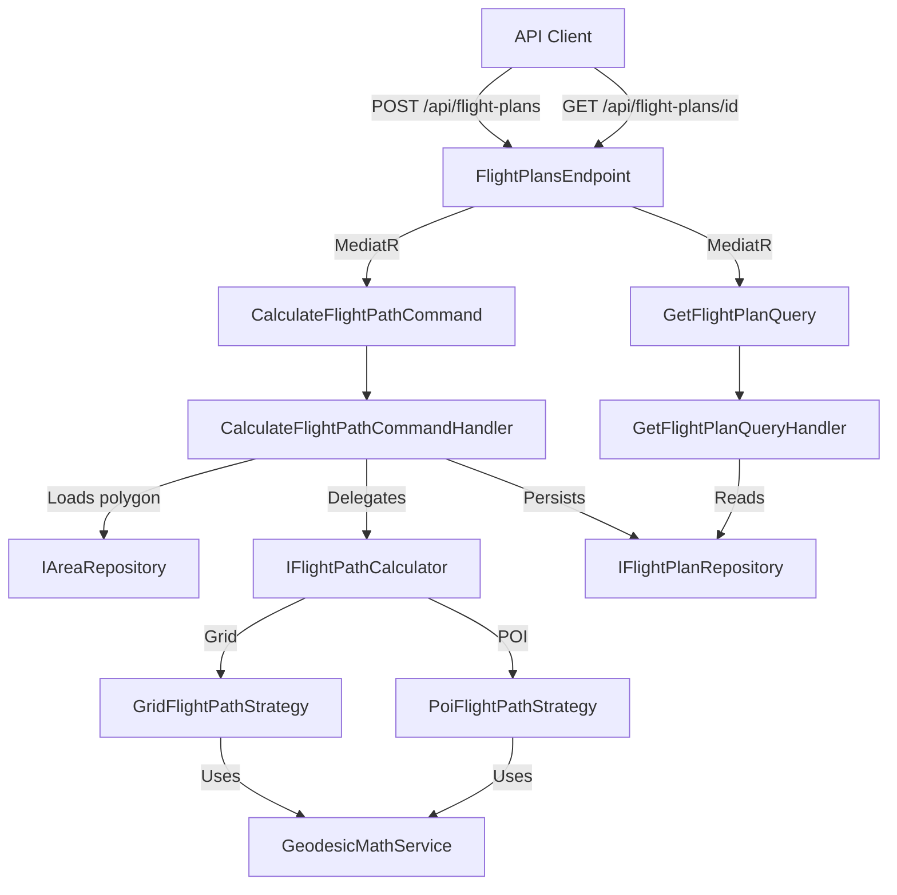
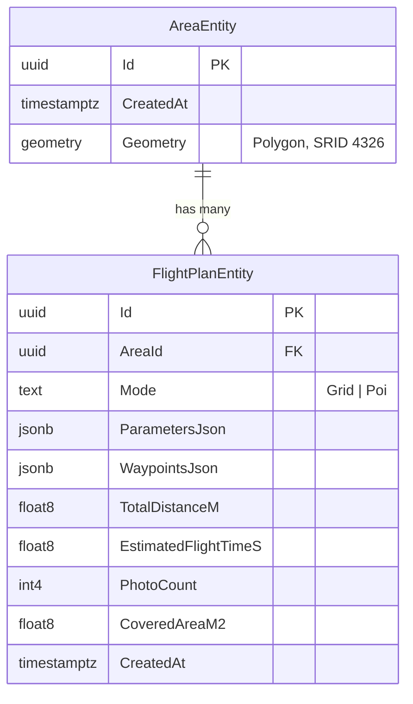
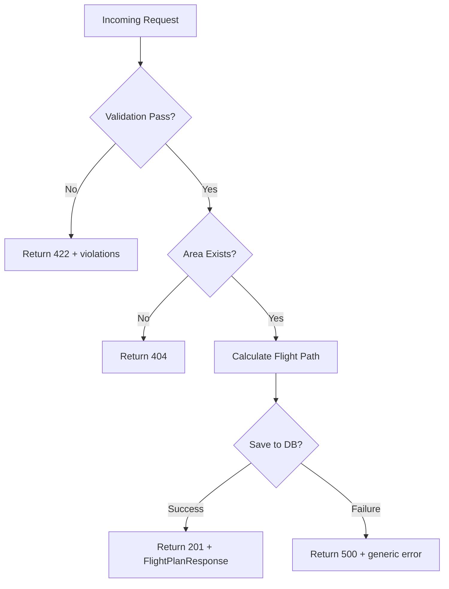

# Design Document: Flight Path Calculation

## Overview

This design describes the flight path calculation engine for DroneMesh3D — a computational component that generates optimal drone flight trajectories over user-defined scan areas. The engine supports two flight modes:

1. **Grid Mode (Lawnmower)** — parallel scan lines covering a polygon for orthophotomaps and 3D models
2. **POI Mode (Orbit)** — circular orbit around a point of interest for facade/structure scanning

The engine integrates with the existing architecture: MediatR for CQRS, EF Core 10 with NetTopologySuite/PostGIS for spatial persistence, OneOf for discriminated union return types, and Minimal API endpoints.

### Key Design Decisions

| Decision | Rationale |
|----------|-----------|
| Pure calculation functions separated from persistence | Enables property-based testing of math logic without database dependencies |
| Strategy pattern for flight modes | Open/Closed principle — new modes can be added without modifying existing code |
| Value objects (sealed records) for parameters | Immutability, self-documenting constraints, compile-time safety |
| WGS84 (SRID 4326) throughout | Consistent with existing AreaEntity storage, avoids projection errors |
| FsCheck for property-based testing | Already established in Core.Tests, proven pattern in the project |

## Architecture



The architecture follows three layers:

1. **API Layer** — Minimal API endpoint + MediatR commands/queries + DTOs
2. **Domain/Calculation Layer** — Pure calculation strategies, value objects, validation
3. **Persistence Layer** — EF Core entities, repository interfaces, PostGIS storage

## Components and Interfaces

### API Layer

#### `FlightPlansEndpoint` (static class)
Maps two routes:
- `POST /api/flight-plans` → dispatches `CalculateFlightPathCommand`
- `GET /api/flight-plans/{id:guid}` → dispatches `GetFlightPlanQuery`

#### `CalculateFlightPathRequest` (sealed record)
```csharp
public sealed record CalculateFlightPathRequest(
    Guid AreaId,
    FlightMode Mode,
    GridModeParameters? Grid,
    PoiModeParameters? Poi);
```

#### `CalculateFlightPathCommand` (record)
```csharp
public record CalculateFlightPathCommand(
    Guid AreaId,
    FlightMode Mode,
    GridModeParameters? Grid,
    PoiModeParameters? Poi)
    : IRequest<OneOf<FlightPlanResponse, ValidationErrorResponse, ErrorResponse>>;
```

#### `GetFlightPlanQuery` (record)
```csharp
public record GetFlightPlanQuery(Guid Id) : IRequest<FlightPlanResponse?>;
```

### Domain Layer — Value Objects

#### `FlightMode` (enum)
```csharp
public enum FlightMode { Grid, Poi }
```

#### `CameraParameters` (sealed record)
```csharp
public sealed record CameraParameters(
    double SensorWidthMm,
    double FocalLengthMm,
    int ImageWidthPx,
    int ImageHeightPx);
```

#### `GridModeParameters` (sealed record)
```csharp
public sealed record GridModeParameters(
    double AltitudeM,
    CameraParameters Camera,
    double FrontOverlapPercent,
    double SideOverlapPercent,
    double? HeadingDegrees);
```

#### `PoiModeParameters` (sealed record)
```csharp
public sealed record PoiModeParameters(
    double CenterLatitude,
    double CenterLongitude,
    double RadiusM,
    double AltitudeM,
    double GimbalPitchDegrees,
    int? PhotoCount,
    double? OverlapPercent,
    double? CameraHorizontalFovDegrees,
    double? StructureHeightM);
```

#### `Waypoint` (sealed record)
```csharp
public sealed record Waypoint(
    double Latitude,
    double Longitude,
    double AltitudeAglM,
    double GimbalPitchDegrees,
    double GimbalYawDegrees);
```

#### `FlightStatistics` (sealed record)
```csharp
public sealed record FlightStatistics(
    double TotalDistanceM,
    double EstimatedFlightTimeS,
    int PhotoCount,
    double CoveredAreaM2);
```

#### `FlightPlanResult` (sealed record)
```csharp
public sealed record FlightPlanResult(
    IReadOnlyList<Waypoint> Waypoints,
    FlightStatistics Statistics);
```

### Domain Layer — Calculation Interfaces

#### `IFlightPathCalculator` (interface)
```csharp
public interface IFlightPathCalculator
{
    FlightPlanResult CalculateGrid(Polygon area, GridModeParameters parameters);
    FlightPlanResult CalculatePoi(PoiModeParameters parameters);
}
```

#### `GridFlightPathStrategy` (sealed class)
Responsibilities:
- Compute GSD from altitude, sensor width, focal length, and image width
- Compute photo footprint on ground
- Compute photo spacing (along-track) using front overlap
- Compute line spacing (cross-track) using side overlap
- Determine scan heading (longest polygon axis or user-specified)
- Generate parallel scan lines across the rotated bounding box
- Clip lines to polygon boundary
- Distribute waypoints along clipped lines at computed spacing
- Generate turnaround points between lines
- Set gimbal pitch to nadir (-90°) or user-specified value

#### `PoiFlightPathStrategy` (sealed class)
Responsibilities:
- Distribute waypoints equally around a circle (360° / photo_count)
- Compute each waypoint's geographic position from center + radius + bearing
- Set gimbal yaw toward center point for each waypoint
- Compute gimbal pitch from geometry (radius, altitude, structure height)
- If overlap is specified instead of photo_count, derive photo_count from FOV and radius

#### `GeodesicMathService` (static class)
Pure utility functions:
- `DestinationPoint(lat, lon, bearingDeg, distanceM)` → (lat, lon) using Vincenty/Haversine
- `BearingBetween(lat1, lon1, lat2, lon2)` → degrees
- `DistanceBetween(lat1, lon1, lat2, lon2)` → meters
- `ComputeGsd(altitudeM, sensorWidthMm, focalLengthMm, imageWidthPx)` → meters/pixel
- `ComputePhotoFootprint(gsd, imageWidthPx, imageHeightPx)` → (widthM, heightM)
- `ComputePhotoSpacing(footprintHeightM, frontOverlap)` → meters
- `ComputeLineSpacing(footprintWidthM, sideOverlap)` → meters
- `LongestAxisHeading(polygon)` → degrees

### Persistence Layer

#### `FlightPlanEntity` (sealed class)
```csharp
public sealed class FlightPlanEntity
{
    public Guid Id { get; set; }
    public Guid AreaId { get; set; }
    public FlightMode Mode { get; set; }
    public string ParametersJson { get; set; } = string.Empty;
    public string WaypointsJson { get; set; } = string.Empty;
    public double TotalDistanceM { get; set; }
    public double EstimatedFlightTimeS { get; set; }
    public int PhotoCount { get; set; }
    public double CoveredAreaM2 { get; set; }
    public DateTimeOffset CreatedAt { get; set; }
    public AreaEntity Area { get; set; } = null!;
}
```

#### `IFlightPlanRepository` (interface)
```csharp
public interface IFlightPlanRepository
{
    Task AddAsync(FlightPlanEntity entity, CancellationToken ct = default);
    Task<FlightPlanEntity?> GetByIdAsync(Guid id, CancellationToken ct = default);
}
```

### Validation

#### `CalculateFlightPathCommandValidator` (sealed class)
FluentValidation-style validation within the MediatR pipeline (using existing `ValidationBehavior`):
- Mode is defined enum value (Grid or Poi)
- Grid parameters present when Mode == Grid
- Poi parameters present when Mode == Poi
- Altitude: 0 < altitude ≤ 120 m
- Front overlap: 75–80%
- Side overlap: 65–75%
- Heading (if provided): 0–360° (fallback to longest axis if outside range)
- Gimbal pitch: -90° to -45°
- POI radius: > 0
- Camera parameters: all positive values

## Data Models

### Database Schema



### EF Core Configuration

```csharp
modelBuilder.Entity<FlightPlanEntity>(entity =>
{
    entity.HasKey(e => e.Id);
    entity.Property(e => e.Id).HasDefaultValueSql("gen_random_uuid()");
    entity.Property(e => e.CreatedAt).HasDefaultValueSql("now()");
    entity.Property(e => e.Mode).HasConversion<string>();
    entity.Property(e => e.ParametersJson).HasColumnType("jsonb");
    entity.Property(e => e.WaypointsJson).HasColumnType("jsonb");
    entity.HasOne(e => e.Area)
          .WithMany()
          .HasForeignKey(e => e.AreaId)
          .OnDelete(DeleteBehavior.Cascade);
});
```

### API Request/Response Models

**POST Request:**
```json
{
  "areaId": "uuid",
  "mode": "Grid",
  "grid": {
    "altitudeM": 80,
    "camera": {
      "sensorWidthMm": 13.2,
      "focalLengthMm": 8.8,
      "imageWidthPx": 5472,
      "imageHeightPx": 3648
    },
    "frontOverlapPercent": 78,
    "sideOverlapPercent": 70,
    "headingDegrees": null
  },
  "poi": null
}
```

**Response (201):**
```json
{
  "id": "uuid",
  "areaId": "uuid",
  "mode": "Grid",
  "waypoints": [
    {
      "latitude": 51.1079,
      "longitude": 17.0385,
      "altitudeAglM": 80,
      "gimbalPitchDegrees": -90,
      "gimbalYawDegrees": 0
    }
  ],
  "statistics": {
    "totalDistanceM": 2450.5,
    "estimatedFlightTimeS": 245,
    "photoCount": 87,
    "coveredAreaM2": 50000
  },
  "createdAt": "2025-06-10T12:00:00Z"
}
```

## Correctness Properties

*A property is a characteristic or behavior that should hold true across all valid executions of a system — essentially, a formal statement about what the system should do. Properties serve as the bridge between human-readable specifications and machine-verifiable correctness guarantees.*

### Property 1: GSD and footprint computation correctness

*For any* valid camera parameters (positive sensor width, focal length, image dimensions) and valid altitude (0 < alt ≤ 120m), the computed GSD shall equal `(altitude × sensorWidth) / (focalLength × imageWidth)`, and the photo footprint shall equal `(GSD × imageWidthPx, GSD × imageHeightPx)`.

**Validates: Requirements 2.2, 2.3**

### Property 2: Spacing computation from overlap

*For any* valid footprint dimensions and overlap percentages (front overlap 75–80%, side overlap 65–75%), the photo spacing shall equal `footprintHeight × (1 - frontOverlap/100)` and the line spacing shall equal `footprintWidth × (1 - sideOverlap/100)`.

**Validates: Requirements 2.4, 2.5**

### Property 3: Grid heading defaults to longest polygon axis

*For any* valid polygon, when no valid heading (0–360°) is specified, the computed scan line heading shall align with the longest axis of the polygon's oriented minimum bounding rectangle. When an invalid heading (outside 0–360°) is provided, the engine shall fall back to this default.

**Validates: Requirements 2.6**

### Property 4: All grid waypoints lie within polygon boundary

*For any* valid polygon and valid grid parameters, every generated waypoint's (latitude, longitude) coordinate shall lie within or on the boundary of the source polygon (using NTS spatial containment with a small tolerance for floating-point precision).

**Validates: Requirements 2.7**

### Property 5: POI waypoints form equidistant closed orbit

*For any* valid POI parameters (center point, radius > 0, photo count ≥ 2), the generated waypoints shall be equally spaced angularly (360° / photoCount between consecutive points), all at the same distance from the center (within floating-point tolerance), and the angular distance from the last waypoint to the first shall equal the spacing between any other consecutive pair.

**Validates: Requirements 3.2, 3.4**

### Property 6: POI gimbal yaw points toward center

*For any* waypoint generated in POI mode, the gimbal yaw value shall equal the geodesic bearing from that waypoint's position to the center point (within ±0.01° tolerance).

**Validates: Requirements 3.3**

### Property 7: Gimbal pitch bounded to [-90°, -45°] for all modes

*For any* flight path calculation (Grid or POI mode) with any valid input parameters, every generated waypoint's gimbal pitch shall be within the range [-90°, -45°] inclusive.

**Validates: Requirements 4.1, 4.2, 4.3**

### Property 8: Altitude validation boundary at 120m

*For any* altitude value > 120m, the engine shall reject the flight plan with a validation error. *For any* altitude value in the range (0, 120] m, the engine shall accept the altitude as valid (assuming all other parameters are valid).

**Validates: Requirements 5.1, 5.2, 5.3**

### Property 9: Overlap validation boundaries

*For any* front overlap value outside [75, 80]%, the engine shall reject with a validation error. *For any* side overlap value outside [65, 75]%, the engine shall reject with a validation error. *For any* front overlap in [75, 80]% and side overlap in [65, 75]%, the engine shall accept both values.

**Validates: Requirements 6.1, 6.2, 6.3, 6.4**

### Property 10: POI photo count satisfies desired overlap

*For any* valid POI parameters specifying overlap (instead of explicit photo count), given a radius and camera horizontal FOV, the computed photo count shall be sufficient such that adjacent photos overlap by at least the requested percentage.

**Validates: Requirements 6.5**

### Property 11: Result completeness and coordinate validity

*For any* successful flight path calculation, the result shall contain a non-empty waypoint list where every waypoint has: latitude ∈ [-90, 90], longitude ∈ [-180, 180], altitude = requested altitude, gimbal pitch ∈ [-90, -45], and a defined gimbal yaw. The result shall also contain flight statistics with all positive values (totalDistanceM > 0, estimatedFlightTimeS > 0, photoCount > 0, coveredAreaM2 > 0).

**Validates: Requirements 7.1, 7.2, 7.3, 10.2**

### Property 12: Invalid parameters produce validation error

*For any* request with at least one invalid parameter (altitude > 120m, overlap out of range, missing mode, non-existent camera values ≤ 0), the engine shall return a validation error result (never a success or unhandled exception).

**Validates: Requirements 9.4**

## Error Handling

| Scenario | HTTP Status | Response Type | Description |
|----------|-------------|---------------|-------------|
| Validation failure (overlap, altitude, missing mode, invalid camera) | 422 | `ValidationErrorResponse` | Detailed list of validation violations |
| Area not found | 404 | Problem Details | `AreaEntity` with given ID does not exist |
| Database write failure | 500 | `ErrorResponse` | Generic error message, no internal details exposed |
| Invalid GeoJSON type in request | 400 | `ErrorResponse` | Malformed request body |
| Unexpected exception | 500 | Problem Details | Caught by existing `GlobalExceptionHandler` middleware |

### Error Flow



### OneOf Return Type

The command handler uses `OneOf<FlightPlanResponse, ValidationErrorResponse, ErrorResponse>` consistent with the existing `CreateAreaCommandHandler` pattern:

- **Match case 1** (`FlightPlanResponse`) → `Results.Created(...)` with location header
- **Match case 2** (`ValidationErrorResponse`) → `Results.UnprocessableEntity(...)`
- **Match case 3** (`ErrorResponse`) → `Results.BadRequest(...)` or `Results.Problem(statusCode: 500, ...)`

## Testing Strategy

### Property-Based Tests (FsCheck + xUnit)

The project already uses **FsCheck 3.3.3** with **FsCheck.Xunit** for property-based testing. Each correctness property maps to one or more `[Property]` test methods.

**Configuration:**
- Minimum 100 iterations per property (`MaxTest = 100`, use `200` for critical math properties)
- Custom `Arbitrary` types for generating valid polygons, camera parameters, and overlap values
- Tag format in XML doc comments: `Feature: flight-path-calculation, Property {N}: {title}`

**Test Organization:**
```
Tests/Core.Tests/
├── FlightPath/
│   ├── GsdCalculationPropertyTests.cs       → Properties 1, 2
│   ├── GridGeometryPropertyTests.cs         → Properties 3, 4
│   ├── PoiGeometryPropertyTests.cs          → Properties 5, 6
│   ├── GimbalPitchPropertyTests.cs          → Property 7
│   ├── ValidationPropertyTests.cs           → Properties 8, 9, 12
│   ├── PoiPhotoCountPropertyTests.cs        → Property 10
│   └── ResultCompletenessPropertyTests.cs   → Property 11
├── FlightPath/Arbitraries/
│   ├── ValidPolygonArbitrary.cs
│   ├── CameraParametersArbitrary.cs
│   ├── GridModeParametersArbitrary.cs
│   └── PoiModeParametersArbitrary.cs
```

**Custom Arbitraries needed:**
- `ValidPolygonArbitrary` — generates convex/concave closed polygons with valid WGS84 coordinates (reuse pattern from existing `ValidRingArbitrary`)
- `CameraParametersArbitrary` — generates realistic sensor widths (4–36mm), focal lengths (4–50mm), resolutions (1000–8000px)
- `GridModeParametersArbitrary` — composes camera, altitude (1–120m), overlaps (75–80%, 65–75%)
- `PoiModeParametersArbitrary` — center points, radii (5–500m), altitudes (1–120m), photo counts (4–72)

### Unit Tests (xUnit)

Example-based tests for:
- Specific known-good calculation results (hand-computed reference values)
- Edge cases: minimum polygon (triangle), maximum altitude (120m exactly), boundary overlaps (75%, 80%, 65%, 75%)
- Error conditions: area not found (404), DB failure (500), missing mode
- Request/response serialization
- MediatR pipeline integration (command → handler → response mapping)

### Integration Tests

- Full HTTP pipeline tests using `WebApplicationFactory`
- POST `/api/flight-plans` with valid Grid and POI requests → 201
- POST with invalid parameters → 422
- POST with non-existent area → 404
- GET `/api/flight-plans/{id}` → 200 with saved plan
- GET with non-existent ID → 404
- Database persistence verification (EF Core with in-memory or test container)

